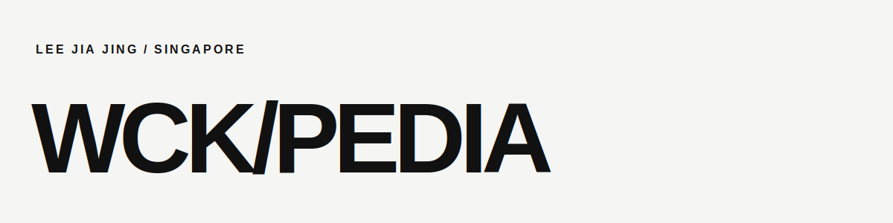

<div align="center">
  
</div>

I build thoughtful interfaces around real product workflows—clear enough to use immediately, polished enough to feel considered. I am especially interested in interaction design, frontend architecture, and the details that turn an idea into a useful product.

I follow technology closely because every shift is another reason to learn, test, and build. I am here to meet other people in software, exchange ideas, and collaborate on interesting work.

## On the workbench

<!-- activity:start -->
| Project | Current focus | Last activity |
| :-- | :-- | --: |
| [current](https://github.com/wckipedia/current) | A focused technology briefing and archive | 18 Jul 2026 |
| [CVify](https://github.com/wckipedia/CVify) | A private, no-sign-up resume builder | 27 Jun 2026 |
| [step-pdf](https://github.com/wckipedia/step-pdf) | A straightforward file-conversion toolkit | 13 Jul 2026 |
| [leejiajing.com](https://github.com/wckipedia/leejiajing.com) | My evolving portfolio and design playground | 11 Jul 2026 |
<!-- activity:end -->

<sub>Repository dates refresh automatically each week. The notes stay curated by hand.</sub>

## Lead story — CVify

**A resume builder designed to keep the entire workflow in the browser.**

CVify is where my frontend interests meet: structured editing, immediate visual feedback, responsive document previews, template systems, local persistence, import/export, and PDF output. The challenge is not simply rendering a form—it is keeping a complex editing experience understandable while every choice updates the final document.

[Explore the source →](https://github.com/wckipedia/CVify)

## Selected work

|  | Project | What I explored |
| :-- | :-- | :-- |
| **01** | [current](https://github.com/wckipedia/current) | Searchable information design, daily and weekly reading views, preferences, and restrained motion. |
| **02** | [step-pdf](https://github.com/wckipedia/step-pdf) | A state-rich conversion flow with drag-and-drop input, clear feedback, and practical failure handling. |
| **03** | [leejiajing.com](https://github.com/wckipedia/leejiajing.com) | Editorial presentation, accessible interaction, variable typography, and motion with performance boundaries. |

## Working principles

```text
01  Make the next action obvious.
02  Use motion to explain state, not decorate it.
03  Treat accessibility and performance as design constraints.
04  Keep learning in public by shipping real things.
```

## Off the clock

Usually keeping up with new technology, playing games, or getting a badminton session in. Based in Singapore.

---

<sub>Open to conversations, shared ideas, and interesting collaborations.</sub>
